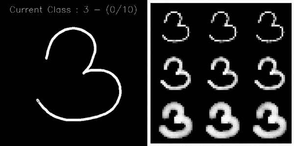

# Python-Interface-to-Create-Handwritten-dataset
Python Interface to Create Handwritten dataset


Original article and full tutorial : [Build Your Fully Configurable Interface to Create MNIST-like Dataset with Python in 10 Minutes](https://medium.com/@axel.thevenot/43ab414a875e?source=friends_link&sk=228606329a318e9bd743515787c1e101)




## Requirements
```
pip3 install -r requirements.txt
or 
pip3 install numpy opencv-python
```

## Run the programm
```
python3 main.py -c path/to/the/config/file.json
or 
python3 main.py -config path/to/the/config/file.json
```

## Configuration JSON file

*  ***input → H*** (int): height of the drawing image
*  ***input → W*** (int): width of the drawing image
*  ***input → thickness*** (float): proportionnal thickness according to the diagonal of the image size
*  ***output → H*** (int): height of the output image
*  ***output → W*** (int): width of the output image
*  ***process → volume*** (int): number of sample by class we can to get at the end
*  ***process → selection*** (str): process of selection. can be RANDOM|CLASSBYCLASS|ROTATE
*  ***process → display_output*** (bool): display the ouput in a window or not
*  ***storage → root*** (str): path to the root folder
*  ***storage → by_class_name*** (bool): store classes in subfolders
*  ***line → thickness*** (int or list of int): proportionnal thickness according to the diagonal of the input size
*  ***line → range_value*** (int or list of int): random range for line value when drawing if list else value for the line
*  ***line → fading*** (float): value of the border fade for a linear fading
*  ***interpolation → method*** (str or list of str): OpenCV interpolation for resizing to ouput. Can be INTER_NEAREST|INTER_LINEAR|INTER_AREA|INTER_CUBIC|INTER_LANCZOS4|RANDOM
*  ***classes*** (list of str): contains the name of all the caracters


Enjoy !
